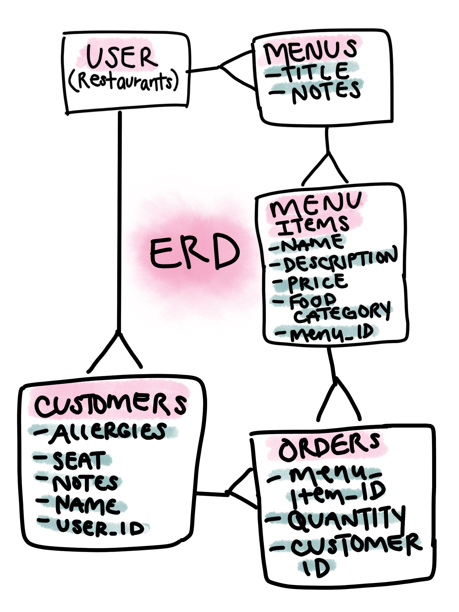

# eWaitr
My vision for this web app is for restaurants to be able to create their menus and have their customers be able to view their menu on an iPad or some other tablet device. Customers would be able to make orders and be sent to the kitchen without the need for a waiter to come to their table and take their order. It would provide much quicker service at restaurants without having to wait for the the waiter to be available to come by the table and take your order. Instead, the host will be able to seat their customers at the table with the app open and they can choose from the menu what they want to order immediately.

## Deployed Front-End Application
[Deployed application on GH pages](https://katwu90.github.io/eWaitr/)

## eWaitr Front-End Application Repository
[Github Repository for eWaitr Front-end](https://github.com/katwu90/eWaitr)

## Deployed API on Heroku
[Deployed API](https://ewaitr.herokuapp.com/)

## eWaitr API Repository
[Github Repository for eWaitr API](https://github.com/katwu90/eWaitr-rails-back-end).

## Planning Process and Problem-Solving Strategies
My planning process for this project was to write down the user stories so I know what the application should be able to do. Using the information from the user stories, I created the resources for the API, I knew that I would need users who were the restaurants and they would need to create their menu and the items in their menu for it to display for their customers to choose from and order. I white board out the different resources I had and the resources I need to join it. For each of the resource I also included the columns that I would need. The hardest part was coming up with the join tables that would connect the different resources I had. One join table that I needed was an orders table that would have a menu item and a quantity and a customer can have multiple orders. Once I was able connect customers with menu items through the orders table it was much clearer how I can declare this relationship with Ruby on Rails. I mapped out this relationship in a Entity Relationship Diagram before creating my resources for my API.

After I had my user stories and entity relationship diagram, I sketched out a wireframe that shows how the application will display this information to the user. Once everything was planned out, I got started on creating the back end one resource at a time and adding in the relatioships as I went along. Then I tested all my API endpoints with CURL scripts to make sure they all worked. I was able to create all resources for my API on the first day of the project.

After creating all the resources and all endpoints were fully functional, I was ready to start creating the front end of the application. For the front end of the application, I decided to use a front end MVC framework, Ember.js. I thought it would be the easiest way to display all the information that I have for all my resources because I would be able create a component for how one item in my resource looks like and be able to use that same component for all the other items in my resource. And since there are so many routes, it is easier to use for the user to interact with when you have different URL paths for all those resources.

Ember.js is front end framework that I learned in a week so I was not entirely comfortable with it but for each new problem that I encountered with Ember, I Googled and read their read a lot of their documentation and I was able to resolve a lot of my errors that way. Luckily their documentation was very beginner friendly which made it possible for me to learn a lot of this as I went along.

Overall this project is still not complete, but I do have two resources beside users with full CRUD function.

## Technologies Used
- HTML
- CSS
- Bootstrap
- Javascript
- Ember.js
- Handlbars
- Ruby on Rails
- PostgreSQL
- Heroku
- Git/Github

## User Stories
A restaurant can sign up for an account.
A registered restaurant can sign in.
A registered restaurant can sign out.
A registered restaurant can their change password.
A registered restaurant can create a menu.
A registered restaurant can add items to their menu.
A registered restaurant can delete a menu.
A registered restaurant can delete items to their menu.
A registered restaurant can edit a menu.
A registered restaurant can edit items to their menu.
A registered restaurant can view all menus.
A registered restaurant can view all items in their menus.

## Entity Relationship Diagram

## API Routes

### Authentication

| Verb   | URI Pattern            | Controller#Action |
|:-------|:-----------------------|:------------------|
| POST   | `/sign-up`             | `users#signup`    |
| POST   | `/sign-in`             | `users#signin`    |
| PATCH  | `/change-password/:id` | `users#changepw`  |
| DELETE | `/sign-out/:id`        | `users#signout`   |

### Menus
| Verb   | URI Pattern  | Controller#Action |
|:-------|:-------------|:------------------|
| GET    | `/menus`     | `menus#index`     |
| GET    | `/menus/:id` | `menus#show`      |
| POST   | `/menus`     | `menus#create`    |
| PATCH  | `/menus/:id` | `menus#update`    |
| DELETE | `/menus/:id` | `menus#destroy`   |

### Menu Items
| Verb   | URI Pattern       | Controller#Action      |
|:-------|:------------------|:-----------------------|
| GET    | `/menu_items`     | `menu_items#index`     |
| GET    | `/menu_items/:id` | `menu_items#show`      |
| POST   | `/menu_items`     | `menu_items#create`    |
| PATCH  | `/menu_items/:id` | `menu_items#update`    |
| DELETE | `/menu_items/:id` | `menu_items#destroy`   |

### Customers
| Verb   | URI Pattern      | Controller#Action     |
|:-------|:-----------------|:----------------------|
| GET    | `/customers`     | `customers#index`     |
| GET    | `/customers/:id` | `customers#show`      |
| POST   | `/customers`     | `customers#create`    |
| PATCH  | `/customers/:id` | `customers#update`    |
| DELETE | `/customers/:id` | `customers#destroy`   |

### Orders
| Verb   | URI Pattern   | Controller#Action  |
|:-------|:--------------|:-------------------|
| GET    | `/orders`     | `orders#index`     |
| GET    | `/orders/:id` | `orders#show`      |
| POST   | `/orders`     | `orders#create`    |
| PATCH  | `/orders/:id` | `orders#update`    |
| DELETE | `/orders/:id` | `orders#destroy`   |

## Install Dependencies
Run `bundle install`

## Work To Be Continued
The other resources (customers & orders) for this application has not been implemented yet. I am still working on creating a customers and customers making orders. I will also eventually want to create a separate table for Food Categories so that all the appetizers and entrees are grouped together, instead of separately as they are right now.
